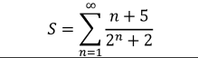

#   Лабораторная работа № 1 
## Алгоритмизация и программирование
### Цель работы: 
усвоить понятие алгоритма как фундаментального понятия информатики,  способы описания, основные типы алгоритмов,  освоить принципы решения задач с использованием основных алгоритмических конструкций.
### Задачи работы
1. Изучить:
    - назначение алгоритма и его определение;
    - формы представления алгоритма.
1. Научиться:
    - работать с основными алгоритмическими конструкциями;
    - представлять алгоритм в виде блок-схемы;
    - приводить примеры алгоритмов и применять их для построения блок- схем,
    - составлять и записывать алгоритм одним из способов
## Общие теоретические сведения
Решение любой задачи на компьютере можно разбить на следующие этапы: разработка алгоритма решения задачи, составление программы решения задачи на алгоритмическом языке, ввод программы в ЭВМ, отладка программы (исправление ошибок), выполнение программы на ПК, анализ полученных результатов.
Алгоритм может быть описан одним из трех способов:
    - словесным;
    - графическим (виде специальной блок-схемы);
    - с помощью специальных языков программирования.
**Блок-схема** - последовательность блоков и связей между ними, предписывающих выполнение определенных операций. Блоки содержат информацию об операциях, а связи - указывают порядок выполнения операций. При соединении блоков следует использовать только вертикальные и горизонтальные линии потоков, которые должны быть параллельны линиям внешней рамки или границам листа. Горизонтальные потоки, имеющие направление справа налево, и вертикальные потоки, имеющие направление снизу-вверх, должны быть помечены стрелками.
Выделяют три вида алгоритмических структур:
    - линейная;
    - разветвляющаяся;
    - циклическая.
1. **Линейные алгоритмы** - это последовательность действий, решающая простейшие задачи, которые выполняются строго последовательно без условий, разветвлений и повторений.
2. **Разветвляющиеся алгоритмы** - это алгоритмы, в которых делается выбор между несколькими возможными путями выполнения в зависимости от условия. Каждый путь называется ветвью алгоритма. Операции условного перехода используются для проверки истинности логического выражения и выбора нужной ветви алгоритма.Логические операции используются для проверки истинности условий в алгоритмах. Операции сравнения (<, >, <=, >=, =, !=) позволяют сравнивать значения переменных. Для связи нескольких условий используются логические операторы И (&&) и ИЛИ (||). Алгоритм с полной развилкой предполагает выполнение разных действий в зависимости от истинности условия. Алгоритм с неполной развилкой содержит только одно действие (Действие1), которое выполняется только в том случае, если условие истинно. Если условие ложно, то никаких действий не выполняется.
3. Циклические алгоритмы - это последовательность действий, выполняемых многократно при новых значениях параметров. Они делятся на циклы с предусловием, циклы с постусловием и параметрические циклы. Циклы с предусловием используются, когда неизвестно количество повторений, и выполняются только при выполнении условия. Для избежания зацикливания необходимо обеспечить изменение значения переменной в условии цикла.
## Задание
#### Вариант 2
Задание 1. В программу вводятся пользователем значения переменных а и b, вычислить значение выражения F. Составить алгоритм решения задачи в соответствии со своим вариантом на алгоритмическом языке и нарисовать блок-схему.  
  
На алгоритмическом языке:   
Алг Задание 1  
вещ a, b, F  
нач  
 ввод a, b  
 F:= (8,15sqrt(3)b * ln(a))/(24,38 * cos(b) * (e^a-a^a))  
 вывод F  
кон  
Блок-схема:  
  
Задание 2. В программу вводятся координаты точки Х и Ү (вещественные числа). Определить, принадлежит ли точка C координатами (Х; Ү) заштрихованной части плоскости.  
  
На алгоритмическом языке:  
алг Задание2  
вещ x, y, z  
нач  
 ввод x, y  
 если x >= 0 && x<= 2 && y >= -2 && y <= 2 то  
 z := x * x + y * y  
 все  
вывод z  
кон  
Блок-схема:  
  
Задание 3. Вычислить сумму S первых n -членов ряда с точностью Е (вводится пользователем). Суммирование членов ряда прекратить, если очередной член ряда у будет меньше Е.  
  
На алгоритмическом языке:    
Алг Задание 3  
нач   
 вещ S, E  
 цел n   
 вещ Sn  
 n:= 0;  
 S:=0;  
 Sn:= (n+5)/(2^n+2);  
 нц пока Sn>E  
 S:=S+Sn;  
 n:=n+1;  
 Sn:=(n+5)/(2^n+2);  
 кц  
 вывод S  
кон  
Блок-схема:  

  
 
